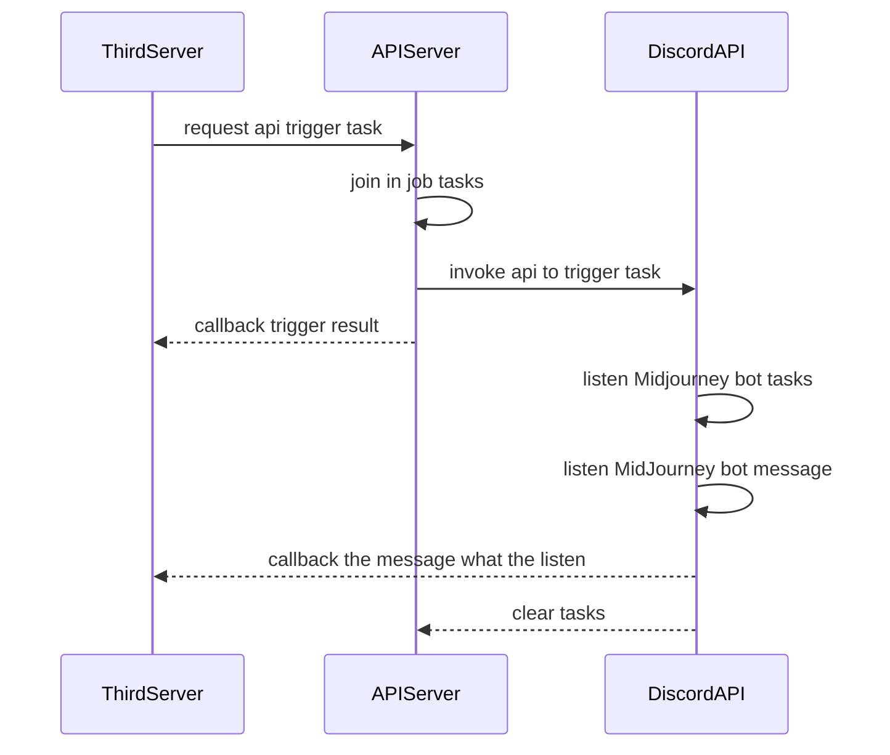

# midjourney-sdk <a href="https://www.npmjs.com/package/midjourney-sdk"></a>

MidJourney in Discord API for Node.js.

## UML



## Install

npm

```bash
npm i midjourney-sdk
```

yarn

```bash
yarn install midjourney-sdk
```

pnpm

```bash
pnpm i midjourney-sdk
```

## Usage

```typescript
import { MidJourney } from 'midjourney-sdk'
const mj = new MidJourney({
  session_id: 'xxxxx',
  guild_id: 'xxxxx',
  token: 'xxxxx',
  channel_id: 'xxxxx'
  // version: 9, # discord api version
})
```

- exec `pnpm example`

## Methods

1. `imagine`: trigger `imagine job` with midjourney

- `value`: the image prompt

2. `upscale`: trigger `U` Button Component Event

- `index`: the index of the `U` Button
- `msg_id`: current message id
- `msg_hash`: current image id, you can get with `url.split('_').at(-1).split('.')[0]`

3. `variation`: trigger `V` Button Component Event

- `index`: the index of the `V` Button
- `msg_id`: current message id
- `msg_hash`: current image id, you can get with `url.split('_').at(-1).split('.')[0]`

4. `reroll`: trigger `🔄` Button Component Event

- `msg_id`: current message id
- `msg_hash`: current image id, you can get with `url.split('_').at(-1).split('.')[0]`

5. `zoomOut`: trigger `Zoom Out 2x` or `Zoom Out 1.5x` Button Component Event

- `size`: `50` is 2x or `75` is 1.5x
- `msg_id`: current message id
- `msg_hash`: current image id, you can get with `url.split('_').at(-1).split('.')[0]`

6. `info`: trigger `/info` command
7. `settings`: trigger `/settings` command
8. `fast`: toggle `fast` mode in global
9. `relax`: toggle `relax` mode in global
